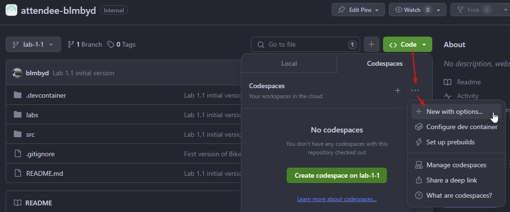
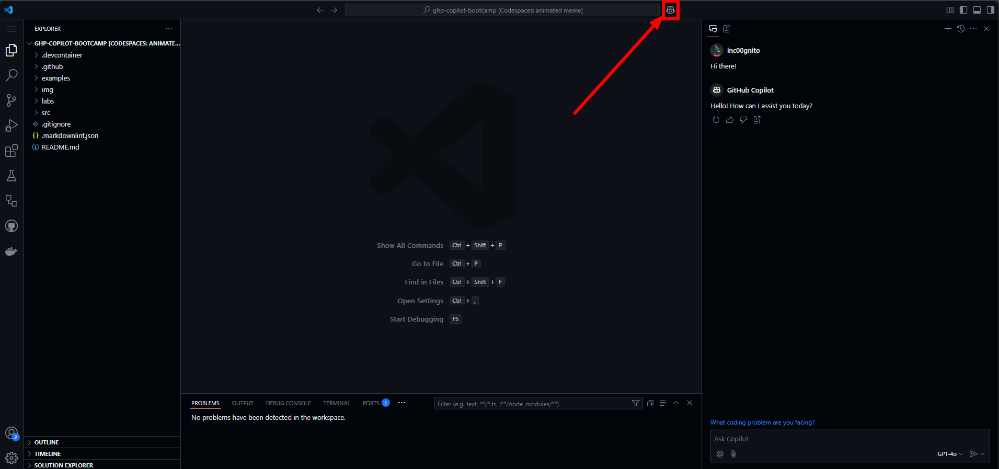
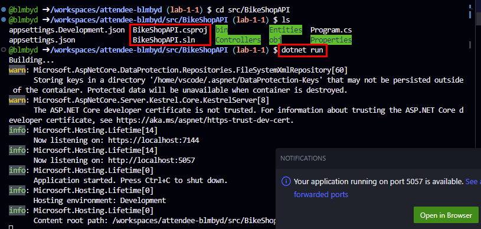
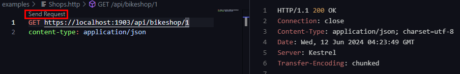

# Lab 0 - Prerequisites: Setting Up GitHub CodeSpaces and your repository

In this Practical Workshop, you will discover how to use your personal GitHub repo with the Codespaces for these practical workshops.

## Time Required

- 10 min

## Goals

- Exploring GitHub Codespaces
- Configure a Codespaces for your repository with specific extensions and settings.
  You can then utilize this Codespace to work on the exercises in the practical workshops.

### Step 1: Understanding Codespaces

GitHub Codespaces is a functionality that permits you to code directly in the browser. It is a cloud-hosted development environment that you can access from any location. It is a fully equipped development environment that can be used to develop, build, and debug your applications. It is based on Visual Studio Code, so you get all the features of Visual Studio Code, including extensions, IntelliSense, and debugging.

- GitHub hosts each Codespaces in a Docker container on a virtual machine, with options ranging from 2 to 32 cores, 8 to 64 GB RAM, and 32 to 128 GB storage. Codespaces default to an Ubuntu Linux image with common languages and tools, but you can customize this with any Linux distribution to meet your specific needs.

### Step 2: Generate a Codespaces in your repository

- Initially, we are going to generate a basic Codespaces that you will use throughout this bootcamp.

Navigate to your personal repository on the URL <https://github.com/[this-org-name]/attendee-[yourhandle]>.

- Locate the `Code` tab near the top menu.
- Click the green `Code` button, then click on `Codespaces`, click the 3 ellipses, "...", and choose `"New with options"`.

- Retain the defaults, but change the machine type to `4-core` and click `Create Codespace`.



Your Codespace is being created. After a few minutes, you will be able to see your Codespace in the browser.

### Step 3: Confirm Functionality

#### Confirm Copilot Functionality

- Click the GitHub Copilot icon at the top of the toolbar of your Codespaces window.



- Type `Hello` and press `Enter` to interact with Copilot.

## Optional Confirmation Steps

### Confirm the application runs

- Start the application and verify the application is running.
- From the terminal window, navigate to the application folder: `cd ./src/BikeShopAPI/`
- Run the application by typing the following command in the terminal:

  ```sh
  dotnet run
  ```

If you encounter an error message like `Project file does not exist.` or `Couldn't find a project to run.`, it's likely that you're executing the command from an incorrect directory. To resolve this, navigate to the correct directory using the command `cd ./src/BikeShopAPI`. If you need to move one level up in the directory structure, use the command `cd ..`. The corrcect directory is the one that contains the `BikeShopAPI.csproj` file.

If you encounter an error message like `Unable to configure HTTPS endpoint. No server certificate was specified...`, you need to generate a developer certificate, to do this run `dotnet dev-certs https` in terminal.



### Verify calling the REST API

#### Rest Client Extension

The REST API client extension is a valuable tool for executing HTTP requests within your IDE and keeping them under version control.

To use the extension, follow these steps:

1. Open the `Examples/Shops.http` file.
2. Click on the "Send Request" button to execute the request.

   ```http
   GET https://localhost:1903/api/bikeshop/1
   content-type: application/json
   ```

   

3. You will receive a `200 OK` response, indicating that the flight has taken off.

   The response will be:

   ```http
   HTTP/1.1 200 OK
   Connection: close
   ```

4. To stop the application, press `Ctrl+C` in the terminal window.

### Verify the unit tests

To verify the unit tests, follow these steps:

1. Open the terminal window.
2. Go into folder `src/BikeShopAPI.Tests` (using `cd` command).
3. Run the command `ls` in the terminal. You should see file `BikeShopAPI.Test.csproj` in output.
4. Run the existing unit tests by executing the command `dotnet test` in the terminal.

   The tests should run and pass. You will see the output similar to this:

   ```text
   Starting test execution, please wait...
   A total of 1 test files matched the specified pattern.
   Passed!  - Failed:  0, Passed:  3, Skipped:  0, Total:  3
   ```
