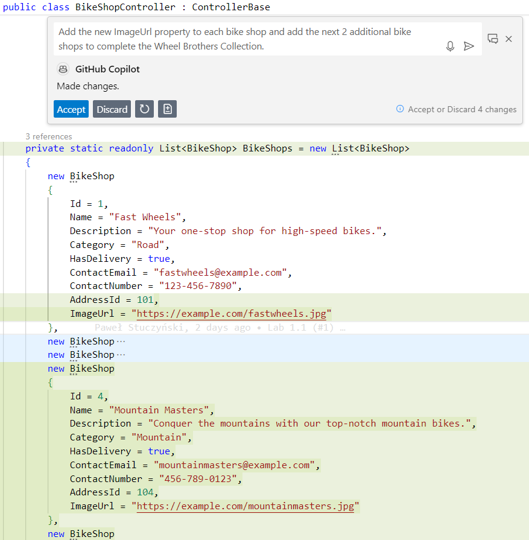
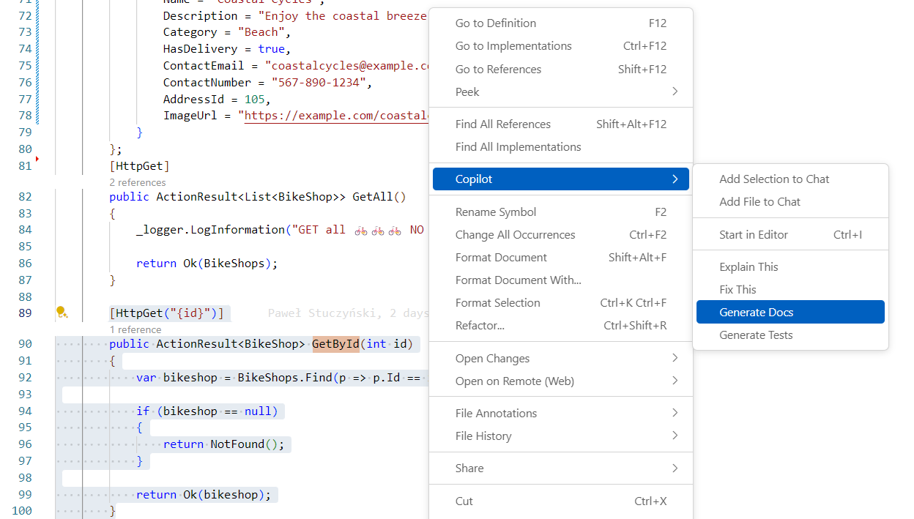
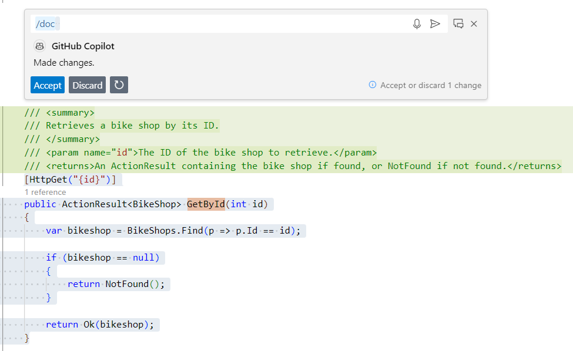
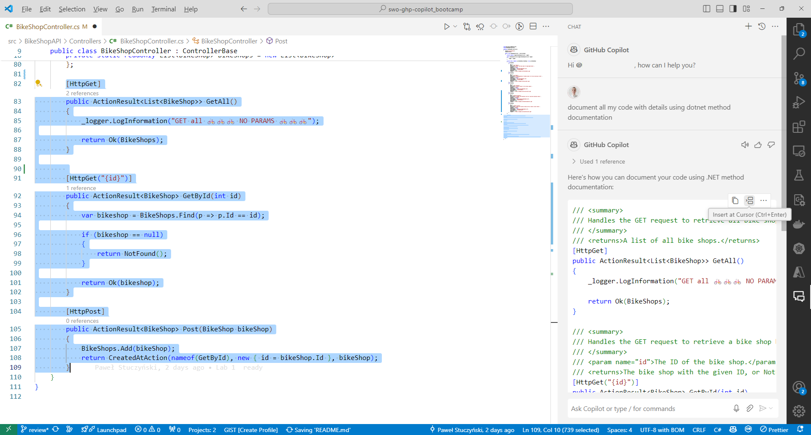
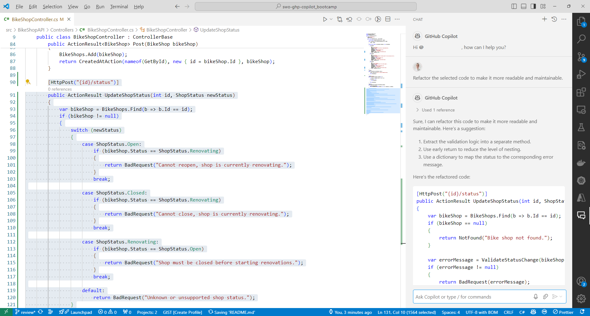
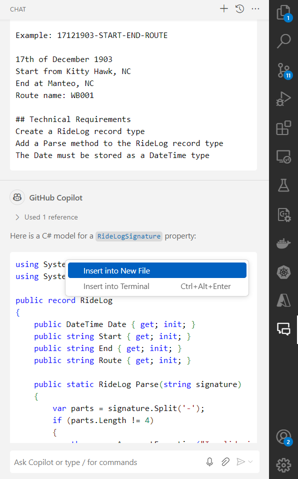
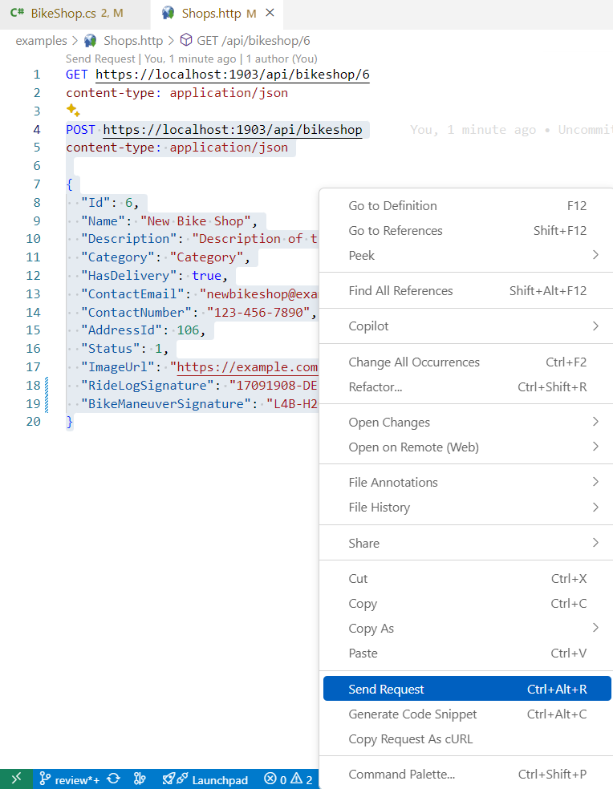
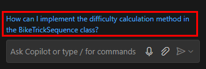
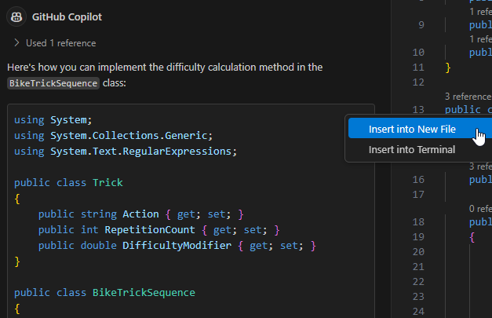

# Lab 3 - Complex tasks: Advanced Features of GitHub Copilot

This lab exercise delves into GitHub Copilot's advanced features, teaching participants to enhance coding efficiency through complex tasks like adding new properties, generating documentation, refactoring code, and parsing strings, supplemented by optional labs on context understanding and regex parsing.

> [!IMPORTANT]
> While GitHub Copilot is a powerful tool, it’s not infallible. The responses it generates can sometimes be incorrect or not exactly what you intended. This is part of the challenge and learning experience. During the workshop, we encourage you to experiment with modifying your prompts to guide GitHub Copilot towards generating the correct code.

## Time Required

- 30 minutes

## Goals

- To master GitHub Copilot's advanced features for solving complex coding exercises and optimizing code.

### Step 1: The complete collection

- Open `BikeShopAPI` folder located in the `src` folder.

- Open the `Entities/BikeShop.cs` file.

- Add a `ImageUrl` property to the model.

- Type `public string? ImageUrl { get; set; }` in the `BikeShop.cs` file.

```csharp
public class BikeShop
{
    public int Id { get; set; }
    public string? Name { get; set; }
    public string? Description { get; set; }
    public string? Category { get; set; }
    public bool HasDelivery { get; set; }
    public int AddressId { get; set; }
    public virtual List<Bike>? Bikes { get; set; }
    public ShopStatus Status { get; set; }
    // New property
    public string? ImageUrl { get; set; }
}
```

- Open the `Controllers/BikeShopController.cs` file.

- Select all content of the `BikeShops` List. You can find it at line `18`.

- Right click and select the option `Copilot` -> `Start Inline Chat`. You can also use `CTRL+I` shortcut instead.

- Type the following command

    ```text
    Add the new ImageUrl property to each bike shop and add the next 2 additional bike shops to complete the Wheel Brothers Collection.
    ```

    

- Accept the suggestion by selecting `Accept` or pressing `Enter`.

    GitHub Copilot can do more than one thing at a time. It added the new property to each bike shop and next Wheel Brothers bike shop to the list of bike shops.

### Step 2: Documenting your code

- Open the `BikeShopAPI` folder located in the `src` folder.

- Open the `Controllers/BikeShopController.cs` file.

- Select all content of the method `GetById` in the `BikeShopController.cs` file.

- Right click and choose for the option `Copilot` -> `Generate Docs`.

    

    

- Do not accept the suggestion, click `Discard`.

    GitHub Copilot used the `/docs` agent to generate the documentation for a single method or the entire file in a matter of seconds. This is a great way to document your codebase quickly and efficiently. However, we will use the Inline Chat to document the code in a more controlled way.

- Let's try this using a different approach, select all content of the method `GetById` in the `BikeShopController.cs` file.

- Open GitHub Copilot Chat, click **+** to clear prompt history, then type the following command:

Compare the difference between asking the two following things:

1. Simple:

    ```text
    Document all my code
    ```

2. More details using dotnet method documentation

    ```text
    document all my code with details using dotnet method documentation
    ```

- Review the documentation to ensure it's accurate, then click on `Insert at cursor` to replace the `BikeShopController.cs` methods with the new documentation.

    

    The difference is that Inline Chat does light documentation vs GitHub Copilot window does a thorough job documenting every important section of code.

### Step 3: Code Refactoring

- Open the `Controllers/BikeShopController.cs` file.

- Navigate to the `UpdateShopStatus` method.

    ```csharp
    public class BikeShopController : ControllerBase
    {

        // Other methods
        [HttpPost("{id}/status")]
        public ActionResult UpdateShopStatus(int id, ShopStatus newStatus)
        {
            var bikeShop = BikeShops.Find(b => b.Id == id);
            if (bikeShop != null)
            {
                switch (newStatus)
                {
                    case ShopStatus.Open:
                        if (bikeShop.Status == ShopStatus.Renovating)
                        {
                            return BadRequest("Cannot reopen, shop is currently renovating.");
                        }
                        break;

                    case ShopStatus.Closed:
                        if (bikeShop.Status == ShopStatus.Renovating)
                        {
                            return BadRequest("Cannot close, shop is currently renovating.");
                        }
                        break;

                    case ShopStatus.Renovating:
                        if (bikeShop.Status == ShopStatus.Open)
                        {
                            return BadRequest("Shop must be closed before starting renovations.");
                        }
                        break;

                    default:
                        return BadRequest("Unknown or unsupported shop status.");
                }

                bikeShop.Status = newStatus;

                return Ok($"Bike shop status updated to {newStatus}.");
            }
            else
            {
                return NotFound("Bike shop not found.");
            }
        }
    }
    ```

    Note that the `UpdateShopStatus` method has a high code complexity rating. This is a good candidate for refactoring.

- Select all the content of the `UpdateShopStatus` method.

- Open GitHub Copilot Chat, click **+** to clear prompt history.

- Ask the following question:

    ```text
    Refactor the selected code to make it more readable and maintainable.
    ```

    

    GitHub Copilot Chat understands `the selected code`. It will use the selected code in your editor to generate the refactoring suggestions.

- Copilot Chat suggests a code improvement to extract some of the complex code to their own methods to make the code more readible and maintainable:

    ```csharp
    [HttpPost("{id}/status")]
    public ActionResult UpdateShopStatus(int id, ShopStatus newStatus)
    {
        var bikeShop = BikeShops.Find(b => b.Id == id);
        if (bikeShop == null)
        {
            return NotFound("Bike shop not found.");
        }

        var errorMessage = ValidateStatusChange(bikeShop.Status, newStatus);
        if (errorMessage != null)
        {
            return BadRequest(errorMessage);
        }

        bikeShop.Status = newStatus;

        return Ok($"Bike shop status updated to {newStatus}.");
    }

    private static string? ValidateStatusChange(ShopStatus currentStatus, ShopStatus newStatus)
    {
        var statusChangeErrors = new Dictionary<(ShopStatus current, ShopStatus newStatus), string>
        {
            {(ShopStatus.Renovating, ShopStatus.Open), "Cannot reopen, shop is currently renovating."},
            {(ShopStatus.Renovating, ShopStatus.Closed), "Cannot close, shop is currently renovating."},
            {(ShopStatus.Open, ShopStatus.Renovating), "Shop must be closed before starting renovations."}
        };

        if (statusChangeErrors.TryGetValue((currentStatus, newStatus), out var errorMessage))
        {
            return errorMessage;
        }

        if (!Enum.IsDefined(typeof(ShopStatus), newStatus))
        {
            return "Unknown or unsupported shop status.";
        }

        return null;
    }
    ```

    The output of Copilot chat can vary, but the output should be a refactored method that is more readable and maintainable.

    Note that GitHub Copilot Chat can make mistakes sometimes. Best practice is to have the method covered with unit tests before refactoring it. This is not a requirement for this lab, but it is a good practice to follow. These unit tests can be generated by GitHub Copilot as well, which is covered in a previous lab.

### Step 4: Prompt Engineering

- Open the `Entities/BikeShop.cs` file.

- Add new `RideLogSignature` property that is of `string` type.

    ```csharp
    public class BikeShop
    {
        // Other properties
        public string RideLogSignature { get; set; }
    }
    ```

    Note that the `RideLogSignature` is a fictional property that is used to demonstrate the capabilities of GitHub Copilot. It is not a real cycling concept.

- Open GitHub Copilot Chat, click **+** to clear prompt history, then ask the following question:

    ```text
    Create a C# model for a RideLogSignature property.

    Example: 17121903-START-END-ROUTE

    17th of December 1903
    Start from Kitty Hawk, NC
    End at Manteo, NC
    Route name: WB001
    
    ## Technical Requirements
    Create a RideLog record type
    Add a Parse method to the RideLog record type
    The Date must be stored as a DateTime type
    ```

- The prompt contains a few-shot prompting example of a `RideLogSignature` and a few technical requirements.

    Few-Shot prompting is a concept of prompt engineering. In the prompt you provide a demonstration of the solution. In this case we provide examples of the input and also requirements for the output. This is a good way to instruct Copilot to generate specific solutions.

- Copilot will suggest a new `RideLog` record type and a `Parse` method. The `Parse` method splits the string and assigns each part to a corresponding property.

    ```csharp
    using System.Globalization;

    public record RideLog
    {
        public DateTime Date { get; init; }
        public string Start { get; init; }
        public string End { get; init; }
        public string Route { get; init; }

        public static RideLog Parse(string signature)
        {
            var parts = signature.Split('-');
            if (parts.Length != 4)
            {
                throw new ArgumentException("Invalid signature format.");
            }

            var date = DateTime.ParseExact(parts[0], "ddMMyyyy", CultureInfo.InvariantCulture);
            var start = parts[1];
            var end = parts[2];
            var route = parts[3];

            return new RideLog
            {
                Date = date,
                Start = start,
                End = end,
                Route = route
            };
        }
    }
    ```

    A C# record type is a reference type that provides built-in functionality for encapsulating data. It is a reference type that is similar to a class, but it is immutable by default. It is a good choice for a simple data container.

    GitHub Copilot is very good at understanding the context of the code. From the prompt we gave it, it understood that the `RideLogSignature` is a string in a specific format and that it can be parsed into a `RideLogSignature` model, to make the code more readable and maintainable.

- In GitHub Copilot Chat, click the ellipses `...` and select `Insert into New File` for the suggested `RideLog` record as `BikeShopAPI/Entities/RideLog.cs`.

    

    GitHub Copilot has many quick actions that can be used to speed up the development process. In this case, it created a new file based on the code suggestions.

- Copilot will add the code to a new empty file, but must be saved.

- Save the file by clicking pressing `Ctrl + S` or `Cmd + S`.

- Navigate to folder `/BikeShopAPI/Entities` and save the file as `RideLog.cs`.

- Now, let's add the new `RideLog` property to the `BikeShop` model.

- Open the `Entities/BikeShop.cs` file.

- Add the `RideLog` property to the `BikeShop` model, by typing `public Rid`

    ```csharp
    public class BikeShop
    {
        public int Id { get; set; }
        // Other props
        public string? RideLogSignature { get; set; }
        public Rid<---- Place cursor here
    }
    ```

- Copilot will suggest the following code:

    ```csharp
    public class BikeShop
    {
        // Other properties
        // ...

        // New properties
        public string RideLogSignature { get; set; }
        public RideLog RideLog => RideLog.Parse(RideLogSignature);
    }
    ```

- Press `Tab` to accept the suggestion, then press `Enter` to add the new property.

- If Copilot didn't suggest the code above, then update the code manually as follows:

    ```csharp
    public class BikeShop
    {
        // Other properties

        // New property
        public RideLog RideLog => RideLog.Parse(RideLogSignature);
    }
    ```

    Copilot used the newly created `RideLog.cs` file in in its context and suggested the `RideLog.Parse` method.

- Now, run the app and test the new functionality.

    ```bash
    cd src/BikeShopAPI
    dotnet run
    ```

- Open `BikeShopAPI/examples/Shops.http` file in the Visual Studio code IDE and POST a new bike shop.

    

- Click the `Send Request` button for the `POST` below:

    ```text
    POST https://localhost:1903/api/bikeshop
    ```

- The Rest Client response will now include the `RideLog` property as follows:

    ```text
    HTTP/1.1 201 Created
    Connection: close
    {
        "id": 6,
        "name": "New Bike Shop",
        "description": "Description of the new bike shop.",
        "category": "Category",
        "hasDelivery": true,
        "addressId": 106,
        "bikes": null,
        "status": 1,
        "imageUrl": "https://example.com/newbikeshop.jpg",
        "rideLogSignature": "17091908-DEP-ARR-WB004",
        "rideLog": {
            "date": "1908-09-17T00:00:00",
            "start": "DEP",
            "end": "ARR",
            "route": "WB004"
        }
    }

    ```

- Note the `rideLog` property that is parsed based on the `RideLogSignature`

- Stop the app by pressing `Ctrl + C` or `Cmd + C` in the terminal.

### Step 5: Advanced Prompt Engineering

- Open the `BikeShop.cs` file.

- Add a new `BikeTrickSignature` property of type string to the `BikeShop.cs` file.

    ```csharp
    public class BikeShop
    {
        
        // Other properties

        // New property
        public string BikeTrickSignature { get; set; }
    }

    ```

- The `BikeTrickSignature` is a fictional property that is used to demonstrate the capabilities of GitHub Copilot. It is not a real cycling concept.

- Some examples of a `BikeTrickSignature` are:
  - L4B-H2C-R3A-S1D-T2E
  - L1A-H1B-R1C-T1E
  - L2A-H2B-R2C

- Let's prompt engineer Copilot to generate a solution for the `BikeTrickSignature` property.

- Open GitHub Copilot Chat, click **+** to clear prompt history, then ask the question:

    ```text
    Parse a BikeTrickSignature property into a C# model.

    ## BikeTrickSequence Examples
    L4B-H2C-R3A-S1D-T2E
    L1A-H1B-R1C-T1E
    L2A-H2B-R2C

    ## Trick
    Actions: L = 360, H = Tuck No-Hander, R = Cash Roll, S = Barspin, T = Table
    Number indicates repetition count
    The Letter represents difficulty (A-E)
    Difficulty modifiers: A = 1.0, B = 1.2, C = 1.4, D = 1.6, E = 1.8
    
    ## Bike Trick Difficulty Method
    Implement a difficulty calculation method with the following rules:
    A Cash Roll after a 360 is scored double
    A Barspin after a Table is scored triple
    
    ## Thought Process
    Example: L4B-R3A-H2C-T2E-S1D

    360: 4 * 1.2 = 4.8
    Cash Roll: 3 * 1 * 2 (Cash Roll a 360) = 6.0
    Tuck No-Hander: 2 * 1.4 = 2.8
    Table: 2 * 1.8 = 3.6
    Barspin: 1 * 1.6 * 3 (Barspin after a Table) = 4.8
    Total Difficulty: 22

    ## Technical Specifications
    - Develop a BikeTrickSequence class with a collection of Tricks and a difficulty attribute
    Introduce the Trick class within the BikeTrickSequence class
    Use a static Parse method for interpreting the BikeTrickSignature
    Interpret the signature with a Regex
    Import the relevant modules to the beginning of the file
    Adjust the difficulty outcome to two decimal places

    Let's think step by step.
    ```

    Sometimes the Copilot doens't complete the output of the prompt. Make sure to try the prompt again if you are not successful the first time.

- Note the `Chain-of-Thought reasoning` heading. In this case we add reasoning about how a difficulty is calculated based on the sequence of tricks.

    Chain-of-Thought (CoT) prompting enables complex reasoning capabilities through intermediate reasoning steps. You can combine it with Few-Shot prompting to get better results on more complex tasks that require reasoning before responding.

- Note the `Let's think step by step.` at the end of the prompt engineering. This is the final instruction for Chain-of-Thought to make Copilot go through the process step by step, like a human would do.

- Also note the Few-Shot examples in the `BikeTrickSequence Examples` heading. Chain-of-Thought with Few-Shot combined is the currently the most powerful way to instruct Copilot to generate specific and accurate solutions. Still it doesn't guarantee that Copilot will generate the correct solution. That will require fine-tuning the prompt (prompt engineering).

- Copilot will output something that looks as follows after inserting the prompt above in Copilot Chat:

    ```text
        1. Create a Trick class with properties for Action, RepetitionCount, DifficultyModifier, and Score.
        2. Create a BikeTrickSequence class with a List<Trick> and a Difficulty attribute.
        3. In the BikeTrickSequence class, create a static Parse method that takes a BikeTrickSignature string as input.
        4. In the Parse method, use a regular expression to split the input string into individual tricks.
        5. For each trick, parse the action, repetition count, and difficulty modifier.
        6. Create a new Trick object with the parsed values and add it to the BikeTrickSequence's list.
        7. Calculate the score for each trick based on the rules provided and add it to the Difficulty attribute.
        8. Round the Difficulty attribute to two decimal places.
        9. Return the BikeTrickSequence object.
    ```

- This is the output of the Chain-of-Thought reasoning. It is a step by step guide to create the `BikeTrickSequence` class. Copilot is thinking step by step, like a human would do.

- Copilot will also suggest a `BikeTrickSequence` class with an implementation that looks like this. The result varies, but the output should be a `BikeTrickSequence` class with a `Trick` class, a `Parse` method and a `CalculateDifficulty` method.

    > The required file already exists. If your output does not align with the provided example, feel free to utilize this existing file.
    >
    > Sometimes, instead of generating a class, Copilot will suggest doing it in the next step. You can click the suggestion to proceed.
    >
    > 

    ```csharp
    using System;
    using System.Collections.Generic;
    using System.Text.RegularExpressions;

    public class Trick
    {
        public string Action { get; set; }
        public int RepetitionCount { get; set; }
        public char DifficultyModifier { get; set; }
        public double Score { get; set; }
    }

    public class BikeTrickSequence
    {
        public List<Trick> Tricks { get; set; } = new List<Trick>();
        public double Difficulty { get; set; }

        public static BikeTrickSequence Parse(string sequence)
        {
            var bikeTrickSequence = new BikeTrickSequence();
            var tricks = Regex.Matches(sequence, @"[A-Z]\d+[A-E]");

            foreach (Match trick in tricks)
            {
                var action = trick.Value[0].ToString();
                var repetitionCount = int.Parse(trick.Value.Substring(1, trick.Value.Length - 2));
                var difficultyModifier = trick.Value[^1];

                var score = CalculateScore(action, repetitionCount, difficultyModifier, bikeTrickSequence);
                bikeTrickSequence.Tricks.Add(new Trick { Action = action, RepetitionCount = repetitionCount, DifficultyModifier = difficultyModifier, Score = score });
                bikeTrickSequence.Difficulty += score;
            }

            bikeTrickSequence.Difficulty = Math.Round(bikeTrickSequence.Difficulty, 2);
            return bikeTrickSequence;
        }

        private static double CalculateScore(string action, int repetitionCount, char difficultyModifier, BikeTrickSequence bikeTrickSequence)
        {
            var difficulty = difficultyModifier switch
            {
                'A' => 1.0,
                'B' => 1.2,
                'C' => 1.4,
                'D' => 1.6,
                'E' => 1.8,
                _ => throw new Exception("Invalid difficulty modifier")
            };

            var score = repetitionCount * difficulty;

            if (bikeTrickSequence.Tricks.Count > 0)
            {
                var lastAction = bikeTrickSequence.Tricks[^1].Action;
                if (lastAction == "L" && action == "R") score *= 2;
                if (lastAction == "T" && action == "S") score *= 3;
            }

            return score;
        }
    }
    ```

- In GitHub Copilot Chat, click the ellipses `...` and select `Insert into New File` for the suggested `BikeTrickSequence` class as `BikeShopAPI/Entities/BikeTrickSequence.cs`.

    

- Copilot will add the code to a new empty file, but must be saved.

- Save the file by clicking pressing `Ctrl + S` or `Cmd + S`.

- Navigate to folder `/BikeShopAPI/Entities` and save the file as `BikeTrickSequence.cs`.

- Now, let's add the new `BikeTrickSequence` property to the `BikeShop` model.

- Open the `Entities/BikeShop.cs` file.

- Add the `BikeTrickSequence` property to the `BikeShop` model.

    ```csharp
    public class BikeShop
    {
        // Other properties
        public string? BikeTrickSignature { get; set; }
        // New property
        public Bik<---- Place cursor here
    }
    ```

- Copilot will suggest the following code:

    ```csharp
    public class BikeShop
    {
        // Other properties
        public string? BikeTrickSignature { get; set; }
        // New property
        public BikeTrickSequence BikeTrickSequence => BikeTrickSequence.Parse(BikeTrickSignature);
    }
    ```

- Press `Tab` to accept the suggestion, then press `Enter` to add the new property.

- If Copilot didn't suggest the code above, then update the code manually as follows:

    ```csharp
    public class BikeShop
    {
        // New property
        public BikeTrickSequence BikeTrickSequence => BikeTrickSequence.Parse(BikeTrickSignature);
    }
    ```

- Now, run the app and test the new functionality.

    ```bash
    cd src/BikeShopAPI
    dotnet run
    ```

- Open `BikeShopAPI/examples/Shops.http` file in the Visual Studio code IDE and POST a new bike shop.

    

- Click the `Send Request` button for the `POST` below:

    ```text
    POST https://localhost:1903/api/bikeshop
    ```

- The Rest Client response will now include the `BikeTrickSequence` property as follows:

    ```text
    HTTP/1.1 201 Created
    Connection: close
    {
        "id": 6,
        <!-- other props -->
        "bikeTrickSignature": "L4B-H2C-R3A-S1D-T2E",
        "bikeTrickSequence": {
            "tricks": [
            {
                "action": "L",
                "repetitionCount": 4,
                "difficultyModifier": "B",
                "score": 4.8
            },
            {
                "action": "H",
                "repetitionCount": 2,
                "difficultyModifier": "C",
                "score": 2.8
            },
            {
                "action": "R",
                "repetitionCount": 3,
                "difficultyModifier": "A",
                "score": 3
            },
            {
                "action": "S",
                "repetitionCount": 1,
                "difficultyModifier": "D",
                "score": 1.6
            },
            {
                "action": "T",
                "repetitionCount": 2,
                "difficultyModifier": "E",
                "score": 3.6
            }
            ],
            "difficulty": 15.8
        }
    }
    ```

- Note the `bikeTrickSequence` property that is parsed based on the `bikeTrickSignature`

- Stop the app by pressing `Ctrl + C` or `Cmd + C` in the terminal.
