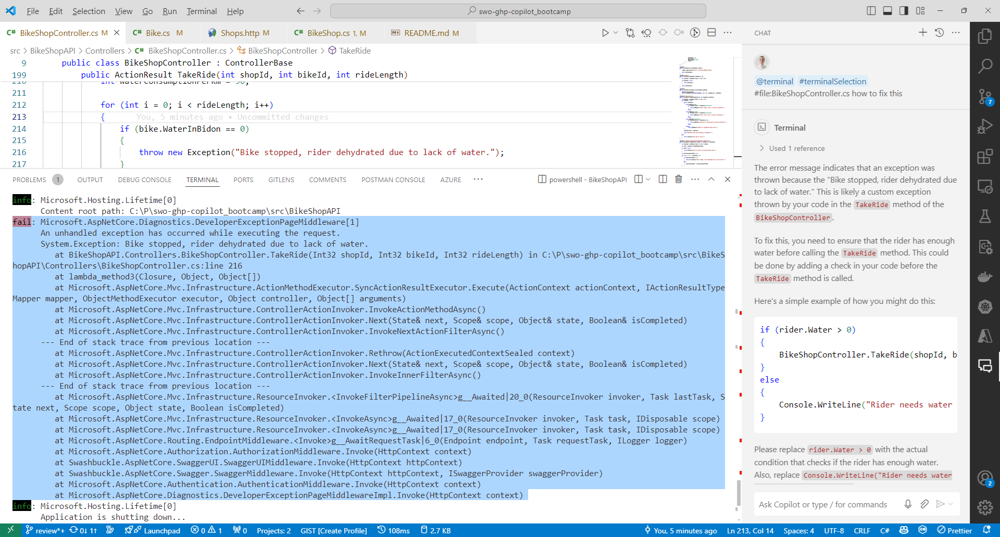
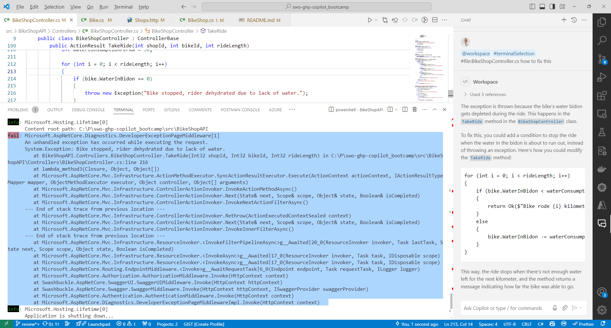
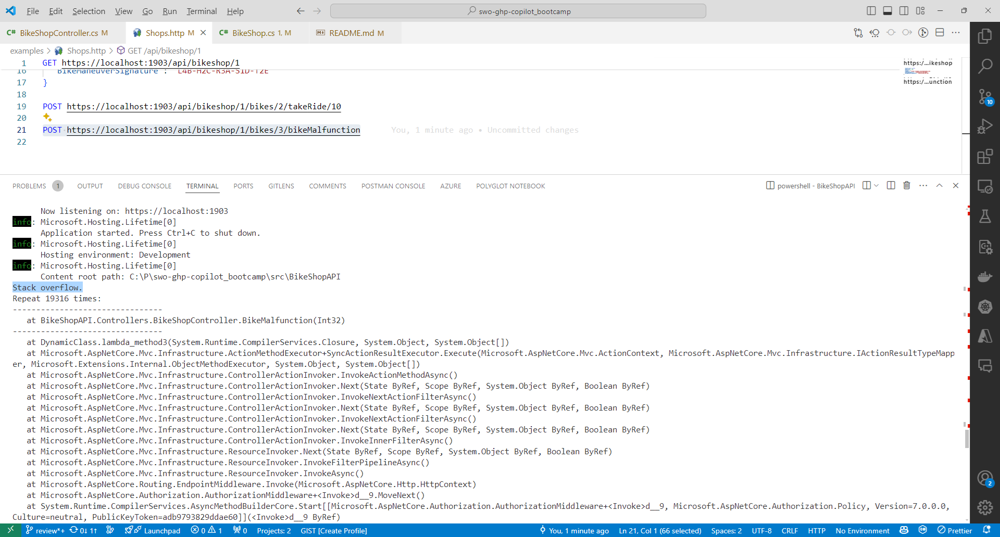
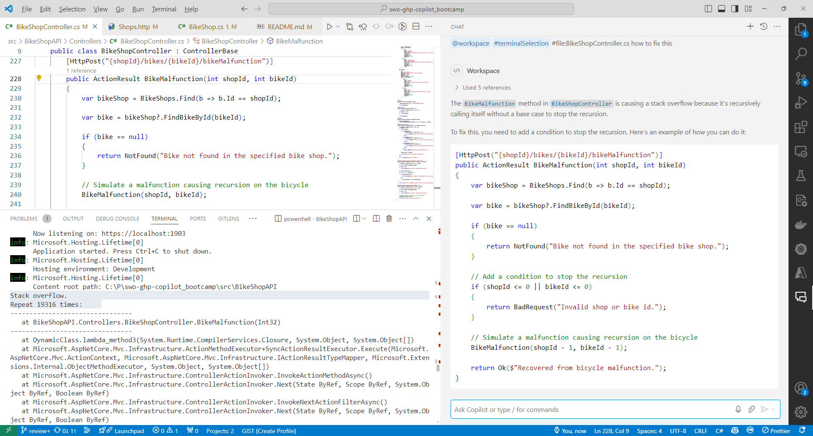
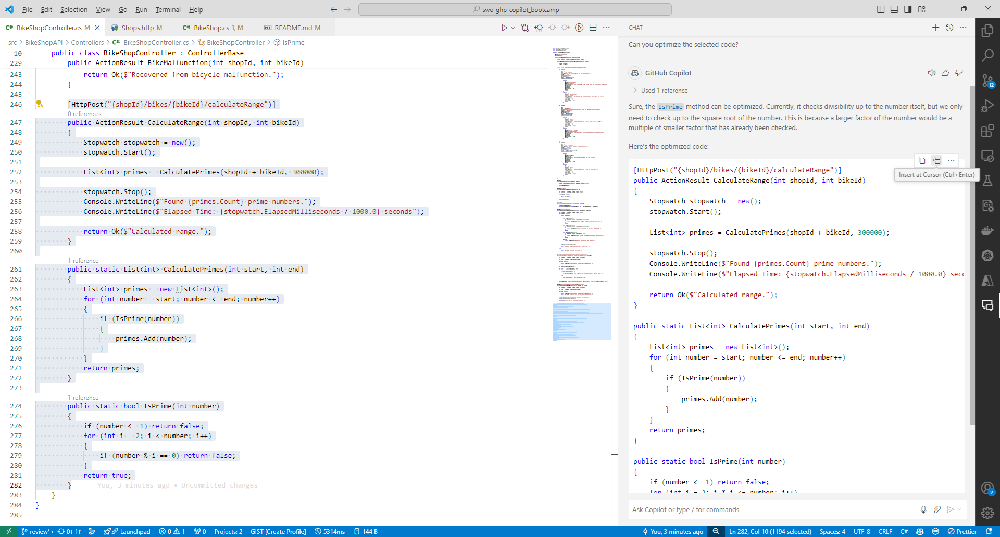

# Lab 4 - Troubleshooting with GitHub Copilot

The module simulates challenging scenarios during bicycle rides using GitHub Copilot to identify and fix the root causes, enhancing understanding of Copilot's limitations and emphasizing human oversight in coding challenges.

> [!IMPORTANT]
> While GitHub Copilot is a powerful tool, it’s not infallible. The responses it generates can sometimes be incorrect or not exactly what you intended. This is part of the challenge and learning experience. During the workshop, we encourage you to experiment with modifying your prompts to guide GitHub Copilot towards generating the correct code.

## Time Required

- 20 minutes

## Goals

- Understanding the limitations of GitHub Copilot and learning how to troubleshoot its suggestions.
- Group challenge to fix a set of buggy codes using Copilot, highlighting the importance of human oversight.

### Step 1. Bike Ride Simulation

- Open `BikeShopController.cs` file located in the `Controllers` folder.

- Navigate to the `TakeRide` method.

    The method simulates a bicycle ride and returns an error if the bicycle rider runs out of water.

```csharp
public class BikeShopController : ControllerBase
{
    [HttpPost("{shopId}/bikes/{bikeId}/takeRide/{rideLength}")]
    public ActionResult TakeRide(int shopId, int bikeId, int rideLength)
    {
        var bikeShop = BikeShops.Find(b => b.Id == shopId);

        var bike = bikeShop?.FindBikeById(bikeId);

        if (bike == null)
        {
            return NotFound("Bike not found in the specified bike shop.");
        }

        int waterConsumptionPerKm = 50;

        for (int i = 0; i < rideLength; i++)
        {
            if (bike.WaterInBidon == 0)
            {
                throw new Exception("Bike stopped, rider dehydrated due to lack of water.");
            }
            else
            {
                bike.WaterInBidon -= waterConsumptionPerKm;
            }
        }

        return Ok($"Bike rode {rideLength} kilometers. Water left in bidon: {bike.WaterInBidon} ml.");
    }
}
```

- Open a terminal and navigate to the `src/BikeShopAPI` folder
- Run the application

    ```sh
    cd src/BikeShopAPI
    dotnet run
    ```

- Open the `BikeShopAPI/examples/Shops.http` file.
- Click `Send Request` to execute the `takeRide` request.

    ```text
    Send Request
    POST https://localhost:1903/api/bikeshop/1/bikes/2/takeRide/10
    ```

    You must have the `Rest Client` with identifier `humao.rest-client` extension installed in Visual Studio Code to execute the request. Rest Client is a very useful extension to quickly execute HTTP requests and commit them to Git.

    ```text
    HTTP/1.1 200 OK
    Connection: close

    Bike rode 10 kilometers. Water left in bidon: 250 ml.
    ```

- Now execute the request again, but now for bike `1`.

- Change the `bikeId` from `2` to `1` in the request and execute it again.

    ```text
    POST https://localhost:1903/api/bikeshop/1/bikes/1/takeRide/10 HTTP/1.1
    ```

- You will see that the bicycle is riding and the response is `500 Internal Server Error`. The bicycle rider ran out of water and stopped due to dehydration.

- The Rest Client response will now include the `RideLog` message as follows:

    ```text
    HTTP/1.1 500 Internal Server Error
    Connection: close

    System.Exception: Bike stopped, rider dehydrated due to lack of water.
   at BikeShopAPI.Controllers.BikeShopController.TakeRide(Int32 shopId, Int32 bikeId, Int32 rideLength) in C:\repos\swo-ghp-copilot_bootcamp\src\BikeShopAPI\Controllers\BikeShopController.cs:line 216
    ```

- Stop the app by pressing `Ctrl + C` or `Cmd + C` in the terminal, or by clicking on the 'Stop' button in the debugger panel.

- Now, let's debug it with GitHub Copilot

- Navigate to the `Terminal` and `select` all the content of the throw exception.

- Open GitHub Copilot Chat, click **+** to clear prompt history, then ask the following question:

    **Option 1**

    If you want to provide more context to GitHub Copilot, you can use the `@terminal` agent. This directive will provide GitHub Copilot access to what the user has selected in the terminal. It can not be used in combination with `@workspace`. So it does not have additional context to generate the suggestion. To add more context to the suggestion you can use `#file:BikeShopController.cs`.

    ```text
    @terminal #terminalSelection #file:BikeShopController.cs how to fix this
    ```

    

    **Option 2**

    If you want to provide more context to GitHub Copilot, you can use the `@workspace` agent. This directive will provide GitHub Copilot access to the entire workspace. It can not be used in combination with `@terminal`. So it does not have additional context to generate the suggestion. To add more context to the suggestion you can use `#file:BikeShopController.cs`.

    ```text
    @workspace #terminalSelection #file:BikeShopController.cs how to fix this
    ```

    

- GitHub Copilot Chat will open and explain the code in a human readable format, instead of the technical exception message.

### Step 2. Stack Overflow Scenario

- Open `BikeShopController.cs` file located in the `Controllers` folder.

- Navigate to the `BikeMalfunction` method.

    The method simulates a bike malfunction and causes recursion.

```csharp
public class BikeShopController : ControllerBase
{
    // Rest of the BikeShopController.cs file

    [HttpPost("{shopId}/bikes/{bikeId}/bikeMalfunction")]
    public ActionResult BikeMalfunction(int id)
    {
        // Simulate a malfunction causing recursion on the bicycle 
        BikeMalfunction(id);

        return Ok($"Recovered from bicycle malfunction.");
    }
}
```

- Open a terminal and navigate to the `src/BikeShopAPI` folder
- Run the application

    ```sh
    cd src/BikeShopAPI
    dotnet run
    ```

- Go to the `BikeShopAPI/examples/Shops.http` file, click `Send Request` to execute the `bikeMalfunction` request.

    ```text
    Send Request
    POST https://localhost:1903/api/bikeshop/1/bikes/1/bikeMalfunction
    ```

- The application will crash.

    ```json
   Stack overflow.
   at BikeShopAPI.Controllers.BikeShopController.BikeMalfunction(Int32)

    ```

    

- Now, let's debug it with GitHub Copilot

- Navigate to the `Terminal` and `select` all the content of the thrown exception.

- Open GitHub Copilot Chat, click **+** to clear prompt, then ask the following question:

    **Option 1**

    If you want to provide more context to GitHub Copilot, you can use the `@terminal` agent. This directive will provide GitHub Copilot access to what the user has selected in the terminal. It can not be used in combination with `@workspace`. So it does not have additional context to generate the suggestion. To add more context to the suggestion you can use `#file:BikeShopController.cs`.

    ```text
    @terminal #terminalSelection #file:BikeShopController.cs how to fix this
    ```

    **Option 2**

    If you want to provide more context to GitHub Copilot, you can use the `@workspace` agent. This directive will provide GitHub Copilot access to the entire workspace. It can not be used in combination with `@terminal`. So it does not have additional context to generate the suggestion. To add more context to the suggestion you can use `#file:BikeShopController.cs`.

    ```text
    @workspace #terminalSelection #file:BikeShopController.cs how to fix this
    ```

- Note that `@terminal` `#terminalSelection` will provide GitHub Copilot access to what the user has selected in the terminal. It can not be used in combination with `@workspace`. So it does not have additional context to generate the suggestion. To add more context to the suggestion you can use `#file:BikeShopController.cs`.

    

- Copilot will suggest how to handle recursion by adding a condition to stop the recursion:

    ```csharp
    public class BikeShopController : ControllerBase
    {
        // Rest of the BikeShopController.cs file

        [HttpPost("{shopId}/bikes/{bikeId}/bikeMalfunction")]
        public ActionResult BikeMalfunction(int shopId, int bikeId)
        {
            var bikeShop = BikeShops.Find(b => b.Id == shopId);

            var bike = bikeShop?.FindBikeById(bikeId);

            if (bike == null)
            {
                return NotFound("Bike not found in the specified bike shop.");
            }

            // Add a condition to stop the recursion
            if (shopId <= 0 || bikeId <= 0)
            {
                return BadRequest("Invalid shop or bike id.");
            }

            // Simulate a malfunction causing recursion on the bicycle 
            BikeMalfunction(shopId - 1, bikeId - 1);

            return Ok($"Recovered from bicycle malfunction.");
        }
    }
    ```

    This is an extreme example. In the real world you will probably not see this often. This example does show how GitHub Copilot can help with debugging and troubleshooting and this technique is applicable to other scenarios as well.

### Step 3: Performance Optimization

- Open `BikeShopController.cs` file located in the `Controllers` folder.

- Navigate to the `CalculateRange` method.

    The method is calculating prime numbers.

```csharp
public class BikeShopController : ControllerBase
{
    [HttpPost("{shopId}/bikes/{bikeId}/calculateRange")]
    public ActionResult CalculateRange(int shopId, int bikeId)
    {
        Stopwatch stopwatch = new();
        stopwatch.Start();

        List<int> primes = CalculatePrimes(shopId + bikeId, 300000);

        stopwatch.Stop();
        Console.WriteLine($"Found {primes.Count} prime numbers.");
        Console.WriteLine($"Elapsed Time: {stopwatch.ElapsedMilliseconds / 1000.0} seconds");

        return Ok($"Calculated range.");
    }

    public static List<int> CalculatePrimes(int start, int end)
    {
        List<int> primes = new();
        for (int number = start; number <= end; number++)
        {
            if (IsPrime(number))
            {
                primes.Add(number);
            }
        }
        return primes;
    }

    public static bool IsPrime(int number)
    {
        if (number <= 1) return false;
        for (int i = 2; i < number; i++)
        {
            if (number % i == 0) return false;
        }
        return true;
    }
}
```

- Open a terminal and navigate to the `BikeShopAPI` folder
- Run the application

    ```sh
    dotnet run
    ```

- Now go to `BikeShopAPI/examples/Shops.http` file, click `Send Request` to execute the `calculateRange` request.

    ```text
    Send Request
    POST https://localhost:1903/api/bikeshop/2/bikes/4/calculateRange
    ```

- Response will be:

    ```json
    HTTP/1.1 200 OK
    Connection: close

    Calculated range.
    ```

- Terminal will show something like this:

    ```json
    Found 25994 prime numbers.
    Elapsed Time: 5.216 seconds.
    ```

- The application will calculate the prime numbers in more than 5 seconds.

- Stop the app by pressing `Ctrl + C` or `Cmd + C` in the terminal, or by clicking on the 'Stop' button in the debugger panel.

- Now, let's use GitHub Copilot to optimize the code.

- Open the Copilot Chat .

- Select all the code for the 3 following methods:
  - `CalculateRange` method.
  - `CalculatePrimes` method.
  - `IsPrime` method.

  

- Ask the following question in GitHub Copilot Chat:

    ```text
    Can you optimize the selected code?
    ```

- Copilot will optimize the code.

- Click on the `Insert at cursor` to replace the `CalculateRange` method with the new one.

- Run the application

    ```sh
    cd src/BikeShopAPI
    dotnet run
    ```

- Now go to `BikeShopAPI/examples/Shops.http` file, click `Send Request` to execute the `CalculateRange` request again.

    ```text
    Send Request
    POST https://localhost:1903/api/bikeshop/2/bikes/4/calculateRange
    ```

    Example output

    ```text
    Found 25997 prime numbers.
    Elapsed Time: 0.014 seconds
    ```

- The application will now calculate the prime numbers in less than 50 milliseconds.

    GitHub Copilot has knowledge of many algorithmic optimizations and can help you optimize your code performance.
