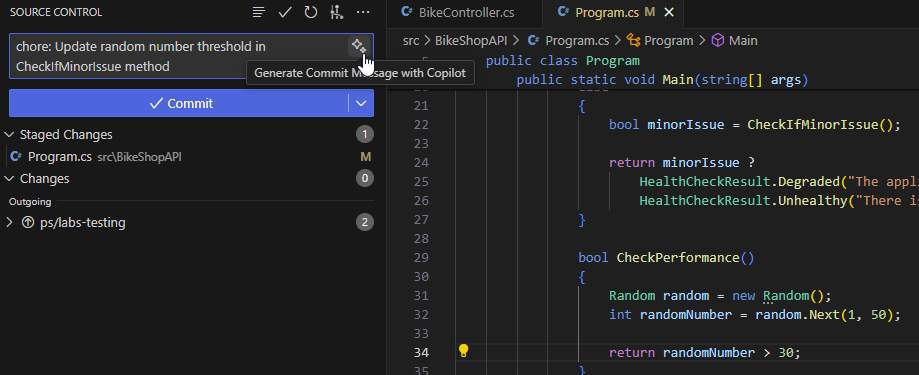
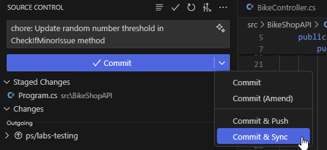
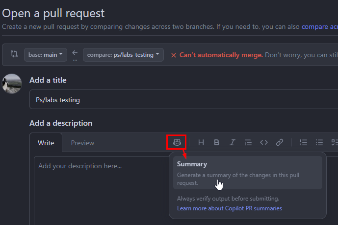
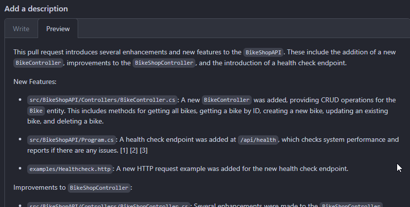

# Lab 5 - Software Development

In order to automate CI/CD pipelines for Azure deployment, implement health checks, and investigate the potential of AI to improve software development efficiency through real-world programming tasks, this lab exercise shows how to integrate GitHub Copilot into.NET application development.

> [!IMPORTANT]
> While GitHub Copilot is a powerful tool, it’s not infallible. The responses it generates can sometimes be incorrect or not exactly what you intended. This is part of the challenge and learning experience. During the workshop, we encourage you to experiment with modifying your prompts to guide GitHub Copilot towards generating the correct code.

## Time Required

- 20 min

## Goals

- Showcase GitHub Copilot's capabilities in.NET development with an emphasis on infrastructure as code, CI/CD pipelines for Azure, automating health checks, and producing succinct "Summary Check in Comments" and "Summary Pull Request Comments."

- Through useful tasks, demonstrate how Copilot can improve code quality, streamline development workflows, and foster collaboration.

### Step 1: Committing Code Changes

- Open `Program.cs` in `BikeShopAPI` folder

- Take note of the following code, which gives the application a health check. The health check simulates a health check that is occasionally degraded, occasionally healthy, and occasionally unhealthy.

    ```csharp
    // ... code

    builder.Services.AddHealthChecks().AddCheck("AppCheck", () =>
    {
        bool isSystemOK = CheckPerformance();

        if (isSystemOK)

        {
            return HealthCheckResult.Healthy("The application is operating.");
        }
        else
        {
            bool minorIssue = CheckIfMinorIssue();

            return minorIssue ?
                HealthCheckResult.Degraded("The application is operating with minor issues but remains stable.") :
                HealthCheckResult.Unhealthy("There is a system failure with the application, which requires immediate attention.");
        }

        bool CheckPerformance()
        {
            Random random = new Random();
            int randomNumber = random.Next(1, 50);

            return randomNumber > 5;
        }

        bool CheckIfMinorIssue()
        {
            Random random = new Random();
            int randomNumber = random.Next(1, 50);

            return randomNumber > 25;
        }
    });

    // code ...
    ```

- To observe the health check in action, launch the application.

    ```sh
    cd BikeShopsApi
    dotnet run
    ```

- Open the `Examples/Healthcheck.http` file, click `Send Request` to execute the `health` request.

- Click the `Send Request` button for the `GET` below:

    ```text
    GET http://localhost:1903/health
    ```

- The response should be `200 OK` with the following body:

    ```text
    Healthy
    ```

- Stop the application by pressing `Ctrl+C` in the terminal.

- Let's modify the code a little bit. Modify the `CheckPerformance` function to yield a random integer bigger than 30. This will mimic a system that is more erratic.

    ```csharp
    bool CheckPerformance()
    {
        Random random = new Random();
        int randomNumber = random.Next(1, 50);

        return randomNumber > 30;
    }
    ```

- Create a new branch `feature/patch-1` from the `main` branch in your terminal

    ```sh
    git checkout -b feature/patch-1
    ```

- In VS Code, select the Source Control tab.

- In the `Changes` area, click the `+` icon to `Stage all changes`

- The `Magic` icon can be clicked to create a commit message.

    

    GitHub Copilot Chat recommends a commit message according to the code modifications. This commit message is an excellent place to start.

- Click the `✓ Commit & Sync` button to commit the changes.

    

- If asked publish branch to push the changes.

## GitHub Copilot Enterprise

### Step 2: Automating Pull Requests on GitHub

Before proceeding, the prior lab must be finished.

- Go to your `GitHub.com` repository.

- Click on the `Pull requests` tab.

- Click on the `New pull request` button

- Select the `main` branch for the base branch.

- Select the `feature/patch-1` branch as the compare branch

- Click the `Create pull request` button

- Click on the `Copilot` icon, select `Summary` to generate a summary of changes in this pull request.

    

- Click `Preview` to see the summary.

    

- Click `Create pull request` to create the pull request.

### Step 3: GitHub Pipelines Automation

Build, test, and deployment procedures for your software can all be automated with a build pipeline, which saves time and improves code quality while guaranteeing reliable and error-free releases. It supports effective version control, facilitates rapid feedback, and expedites development.  First, let's automate pipelines for continuous integration and delivery to Azure.

- Open GitHub Copilot Chat

- To create a GitHub Action Workflow, enter the following command::

    ```text
    @workspace create a workflow to build and test BikeShopAPI.sln
    ```

- or type to generate Azure DevOps pipeline

    ```text
    @workspace create a Azure DevOps pipeline to build and test BikeShopAPI.sln
    ```

- For the application, GitHub Copilot Chat will create a build pipeline. It has a test step and a build step.

- Example genrated of pipeline (GitHub Workflow):

    ```yml
    name: Build and Test

    on:
    push:
        branches: [ main ]
    pull_request:
        branches: [ main ]

    jobs:
    build:

        runs-on: ubuntu-latest

        steps:
        - uses: actions/checkout@v2

        - name: Setup .NET
        uses: actions/setup-dotnet@v1
        with:
            dotnet-version: 7.0.x

        - name: Restore dependencies
        run: dotnet restore "src/BikeShopAPI/BikeShopAPI.sln"

        - name: Build
        run: dotnet build "src/BikeShopAPI/BikeShopAPI.sln" --configuration Release --no-restore

        - name: Test
        run: dotnet test "src/BikeShopAPI.Test/BikeShopAPI.Test.csproj" --no-restore --verbosity normal
    ```

- Example genrated of pipeline (Azure DevOps):

    ```yml
    trigger:
    - main

    pool:
    vmImage: 'windows-latest'

    variables:
    solution: '**/BikeShopAPI.sln'
    buildPlatform: 'Any CPU'
    buildConfiguration: 'Release'

    steps:
    - task: NuGetToolInstaller@1

    - task: NuGetCommand@2
    inputs:
        restoreSolution: '$(solution)'

    - task: VSBuild@1
    inputs:
        solution: '$(solution)'
        platform: '$(buildPlatform)'
        configuration: '$(buildConfiguration)'

    - task: VSTest@2
    inputs:
        platform: '$(buildPlatform)'
        configuration: '$(buildConfiguration)'
    ```

- In GitHub Copilot Chat, click the ellipses `...` and select `Insert into New File`.
- Save the file by clicking pressing `Ctrl + S` or `Cmd + S`.
- (GitHub Workflow option) Change directory to the `.github/workflows` folder`.
- Enter the file name `Build.yml` and click `Save`.

GitHub Copilot recognizes that the current workspace is a.NET application with a Test project inside of it thanks to the @workspace agent. Additionally, it recognizes that the test project is located in a folder named `BikeShopsAPI.Tests` and that the application is hosted in a folder named `BikeShopsAPI`. This is a fantastic illustration of how GitHub Copilot can recognize the context of the active workspace and make recommendations according to it.

### Step 4: How to assent to the Azure Cloud

By using Microsoft's cloud infrastructure, deploying your application to Azure enables scalable, secure, and effective hosting. This improves the functionality and accessibility of your app while lowering maintenance costs and effort. It also enables simple scaling, strong disaster recovery, and worldwide reach.

Before proceeding, the prior lab must be finished.

- A legitimate `*.yml` build pipeline from the previous step is a prerequisite.

- Select all the content of the `Build.yml`.

- In GitHub Copilot Chat, click **+** to clear prompt history, then type the following command.

    ```text
    Deploy to Azure
    ```

- GitHub Copilot Chat will suggest adding a deploy step to the pipeline, which is a Azure Web App deployment.

- In GitHub Copilot Chat, click the ellipses `...` and select `Insert into New File` for the suggested pipeline.
- Save the file by clicking pressing `Ctrl + S` or `Cmd + S`.
- (GitHub Workflow option) Change directory to the `.github/workflows` folder`.
- Enter the file name `Deploy.yml` and click `Save`.

- Enter the command below in a new GitHub Copilot Chat session.

    ```text
    @workspace create the Bicep code files for the infrastructure I need for an Azure web application.
    ```

- In GitHub Copilot Chat, click the ellipses `...` and select `Insert into New File` for the suggested pipeline.
- Save the file by clicking pressing `Ctrl + S` or `Cmd + S`.
- Change directory to the `src` root folder`.
- Enter the file name `Main.bicep` and click `Save`.

### Step 5: Using Bicep IaC to Create an Detailed DevOps Pipeline

Modern cloud infrastructure management requires the use of Infrastructure as Code (IaC) for managing cloud resources. Bicep for Azure environments offers several noteworthy benefits that make IaC an indispensable practice.

GitHub One of Copilot's most useful features is its advanced prompt, which lets you pose intricate queries and get thorough answers. It can assist you in organizing and carrying out difficult tasks, making sure that each step is precisely stated and logically ordered for effective completion.

#### Option 1:  Describe the Three Stages of a Single DevOps Pipeline

Build, Infrastructure as Code (IaC), and Quality Assurance (QA) are the three stages of a DevOps pipeline that will be created using this prompt. Each step's requirements are listed, including how to create Bicep templates, describe the application, identify the Azure resources required, and walk through the process of deploying the application to Azure for quality assurance.

- Open GitHub Copilot Chat, , click **+** to start new chat.
- Pose the following advanced thought-provoking query:

    ```text
    Create a single DevOps pipeline with three phases: Build, Quality Assurance (QA), and Infrastructure as Code (IaC). 

    - **Stage 1: Build**
    - Explain the architecture and the application.
    - Enumerate the frameworks and programming languages utilized.
    - Describe the procedures involved in building and compiling the application.
    
    - **Stage 2: IaC**
    - Describe Bicep and the reasons behind its selection for this project.
    - Indicate which Azure resources (such as App Service and Azure SQL Database) are needed for the application.
    - For these resources, request the creation of Bicep templates, emphasizing any interdependencies.

    - **Stage 3: QA**
    - Explain the Azure deployment environment.
    - Enumerate the necessary tests (unit, integration, and user interface tests, for example).
    - Describe how to deploy the application to Azure for quality assurance.
    
    Draft a thorough plan for every phase, making sure that each step is specified precisely and made sense in order to be carried out quickly.

    Do it step by step
    ```

By decomposing each step into more specific tasks and requesting particular results, this prompt clarifies things. With this approach, Copilot is more likely to think through things logically and produce results that are almost exactly what you need. You're more likely to get a thorough and useful plan from GitHub Copilot if you give more context and specifics.

#### Option 2 - Using Detailed File Outlines to Improve the DevOps Pipeline

Let's tweak the Chain of Thought prompt to specifically call for the creation of file outlines or templates in order to further improve it and provide clear guidance for GitHub Copilot to create each necessary file.

Using this prompt, a CI/CD pipeline configuration plan for a.NET 7 Web API application will be created. It consists of three stages: Infrastructure as Code (IaC) with Bicep for Azure resource deployment, Quality Assurance (QA) for deploying the application to a QA environment and conducting tests, and Build for compiling the solution and executing tests.

With this method, a more organized and useful result will be produced, complete with scaffolding for every phase of the project.

- Open GitHub Copilot Chat, click **+**.
- Pose the following advanced thought-provoking query:

    ```text
    Let’s establish a CI/CD pipeline for a .NET 7 Web API application, encompassing Build, Infrastructure as Code (IaC) deployment via Bicep, and Quality Assurance (QA) stages. Each stage needs to be explicitly defined, and essential files and configurations should be prepared.

    1. **.NET 7 Web API Build Stage**:
    - The application is constructed using .NET 7, with C# as the programming language. Arrange the build process, which should comprise steps for restoring NuGet packages, compiling the solution, executing unit tests, and publishing the output. Formulate a ‘build.yml’ file that delineates these steps for the CI pipeline.

    2. **Bicep Execution in IaC Stage**:
    - For Azure deployment, pinpoint the necessary Azure resources (e.g., Azure App Service for hosting the Web API). Arrange Bicep templates for these resources, ensuring their modularity and reusability.
    - Formulate a ‘main.bicep’ file that serves as the entry point, calling other Bicep files (e.g., ‘appservice.bicep’) to define the complete infrastructure. Incorporate a step in the CI/CD pipeline (‘iac-deploy.yaml’) to authenticate with Azure and execute ‘main.bicep’, deploying the infrastructure

    3. **QA Stage**:
    - Elaborate on the procedure for deploying the .NET 7 Web API to the provisioned Azure App Service in a QA environment. This includes the execution of integration and acceptance tests.
    - Prepare a ‘qa-deploy.yml’ file that delineates the steps for deploying the application to Azure, setting up the environment, and running tests.

    4. **Chain Workflows**:
    - Ensure that the Build pipeline initiates the IaC pipeline, which subsequently triggers the QA pipeline.
    - This will enable the triggering of a workflow upon the completion of another workflow.

    In addition to preparing these files, offer explanations for the purpose of each file and the crucial sections within them. This strategy ensures a thorough understanding and accurate implementation of the pipeline for deploying a .NET 7 Web API application to Azure.
    ```

> [!TIP]
> To generate Azure DevOps pipelines add extra line at end:
> "Make sure that those pipelines will run in Azure DevOps enviroment."

This prompt is designed to make sure that GitHub Copilot creates a comprehensive plan that breaks down the specifications for the CI/CD pipeline of a.NET 7 Web API application, with an emphasis on IaC with Bicep for Azure deployments. Specifically requesting a "main.bicep" to coordinate the release of additional Bicep modules steers the AI toward building an infrastructure that is both scalable and maintainable.

The creation of a directive to establish a single pipeline with stages for Build, IaC using Bicep, and QA for cloud resources marked the beginning of the evolution of the Chain of Thought (CoT) techniques throughout our conversation. The original CoT prompt was more concerned with what to do than with how and why to do it, and it lacked clear steps and justification for each step.

We then improved the strategy to divide the work into more specific steps, providing context and justifications to help GitHub Copilot work more efficiently. This did not completely integrate the execution of Bicep files, but it did include describing the application, defining resources, and outlining actions for each step.

In the end, we made additional changes to the prompt for a.NET 7 Web API application, specifically mentioning the running of Bicep files via a main.bicep file. This method offered a thorough, step-by-step tutorial that clarified what had to be done as well as how to do it, with particular attention to modifying the tasks for.NET 7 and guaranteeing an executable and modular IaC setup.
